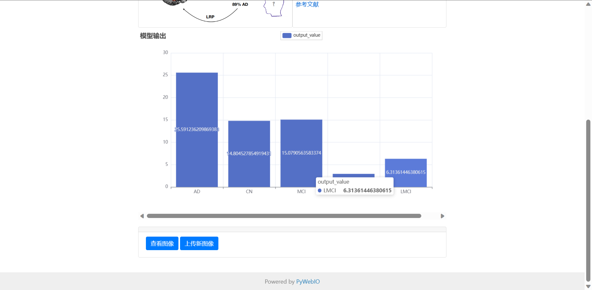

# Image-Recognition-system

基于 ADNI 数据集的阿尔兹海默智能诊断 Web 应用

简单医学影像识别系统，图像识别可视化界面，OCR，快速部署深度学习模型为网页应用，Web 预测系统，图像识别前端网页，图像识别 Demo 展示-Pywebio。AI 人工智能图像识别-Pytorch；nii 医学影像处理；ADNI 数据集。100%纯 Python 代码，轻量化，易复现

[个人网站：www.bytesc.club](http://www.bytesc.club) 包含在线演示

## 功能简介

- 1, 根据脑部 MRI 医学影像智能诊断阿尔兹海默病
- 2, 使用纯 python 编写，轻量化，易复现，易部署
- 3, 代码可读性高，核心部分有极详细注释

## 界面展示

- 上传图像
  
- 返回结果
  
- 模型输出图表
  
- 查看上传的图像
  

## 如何使用

python 版本 3.9

需要 `4GB` 以上内存

先安装依赖

```bash
pip install -r requirement.txt
```

zlzheimer-diagnostic-system.py 是项目入口，运行此文件即可启动服务器

```bash
python zlzheimer-diagnostic-system.py
```

复制链接到浏览器打开


点击”Demo“即可进入 Web 界面


之后，可以点击“使用示例图像”使用默认的测试样例。也可以上传.nii 图像文件上传测试。
我在 [`lqdata`仓库](https://github.com/bytesc/lqdata) 提供了少量示例图像数据。
```bash
git clone https://github.com/bytesc/lqdata.git
```

## 项目结构

```
.
│  zlzheimer-diagnostic-system.py
│  datasets.py
│  model.py
│  train.py
│  myModel_109.pth
│  README.md
│  requirements.txt
│
├─demodata
│  │  demo.nii
├─readme_img
└─uploaded_img
```

- zlzheimer-diagnostic-system.py 项目主文件，用于启动 Web 应用
- datasets.py 处理数据集
- model.py 定义模型
- train.py 训练模型
- myModel_109.pth 训练好的模型
- readme_img 文件夹存放上传的医学影像和渲染的图片
- demodata 文件夹用于存放一些医学影像文件，用于测试

## 分类器核心代码

```python
from torch import nn
import torch

class ClassificationModel3D(nn.Module):
    """分类器模型"""
    def __init__(self, dropout=0.4, dropout2=0.4):
        nn.Module.__init__(self)

        # 定义四个Conv3d层
        self.Conv_1 = nn.Conv3d(1, 8, 3)  # 输入通道数为1，输出通道数为8，卷积核大小为3x3x3
        self.Conv_2 = nn.Conv3d(8, 16, 3)  # 输入通道数为8，输出通道数为16，卷积核大小为3x3x3
        self.Conv_3 = nn.Conv3d(16, 32, 3)  # 输入通道数为16，输出通道数为32，卷积核大小为3x3x3
        self.Conv_4 = nn.Conv3d(32, 64, 3)  # 输入通道数为32，输出通道数为64，卷积核大小为3x3x3

        # 定义四个BatchNorm3d层，每个卷积层后面跟着一个BatchNorm3d层
        self.Conv_1_bn = nn.BatchNorm3d(8)
        self.Conv_2_bn = nn.BatchNorm3d(16)
        self.Conv_3_bn = nn.BatchNorm3d(32)
        self.Conv_4_bn = nn.BatchNorm3d(64)

        # 定义四个MaxPool3d层，每个卷积层后面跟着一个MaxPool3d层
        self.Conv_1_mp = nn.MaxPool3d(2)  # 池化核大小为2
        self.Conv_2_mp = nn.MaxPool3d(3)  # 池化核大小为3
        self.Conv_3_mp = nn.MaxPool3d(2)  # 池化核大小为2
        self.Conv_4_mp = nn.MaxPool3d(3)  # 池化核大小为3

        # 定义两个全连接层
        self.dense_1 = nn.Linear(4800, 128)  # 输入维度为4800，输出维度为128
        self.dense_2 = nn.Linear(128, 5)  # 输入维度为128，输出维度为5。因为这是一个五分类问题，所以最终需要输出维度为5

        # 定义ReLU激活函数和dropout层
        self.relu = nn.ReLU()
        self.dropout = nn.Dropout(dropout)  # 防止过拟合
        self.dropout2 = nn.Dropout(dropout2)  # 增强鲁棒性

    def forward(self, x):
        # 第一层卷积层
        x = self.relu(self.Conv_1_bn(self.Conv_1(x)))
        """
        这行代码是对输入 x 进行卷积、批归一化和 ReLU 激活函数的操作。

        self.Conv_1(x) 对输入 x 进行 3D 卷积操作，输出一个特征图。

        self.Conv_1_bn(...) 对卷积输出的特征图进行批归一化操作，得到归一化后的特征图。

        self.relu(...) 对归一化的特征图进行 ReLU 激活函数操作，得到激活后的特征图。

        整个操作的作用是提取输入 x 中的特征，并将其非线性化，使得网络能够更好地学习这些特征。这里使用了批归一化的技术，可以加速模型的训练过程并提高模型的泛化能力。最终得到的输出结果是经过卷积、批归一化和 ReLU 激活函数处理后的特征图 x。
        """
        # 第一层卷积层的最大池化
        x = self.Conv_1_mp(x)
        """
        这行代码是对输入 x 进行最大池化操作，将特征图的大小缩小一半。

        self.Conv_1_mp(...) 对输入 x 进行最大池化操作，池化核大小为 2。

        池化操作会将特征图中每个池化窗口内的最大值提取出来，作为输出特征图的对应位置的值，从而将特征图的大小缩小一半。

        最大池化操作可以帮助网络实现空间不变性，使得网络在输入发生轻微变化时仍能识别出相同的特征。在这个模型中，经过最大池化后的特征图 x 会传递到下一层卷积层中进行特征提取和非线性化处理。
        """
        # 第二层卷积层
        x = self.relu(self.Conv_2_bn(self.Conv_2(x)))
        # 第二层卷积层的最大池化
        x = self.Conv_2_mp(x)
        # 第三层卷积层
        x = self.relu(self.Conv_3_bn(self.Conv_3(x)))
        # 第三层卷积层的最大池化
        x = self.Conv_3_mp(x)
        # 第四层卷积层
        x = self.relu(self.Conv_4_bn(self.Conv_4(x)))
        # 第四层卷积层的最大池化
        x = self.Conv_4_mp(x)
        # 将张量展平为一维向量
        x = x.view(x.size(0), -1)
        """
        这行代码是将输入张量 x 展平为一维向量。

        x.size(0) 得到输入张量 x 的第一个维度的大小，也就是张量的批次大小。

        -1 表示将第二个维度及其后面的所有维度展平为一维。

        x.view(...) 对输入张量 x 进行形状变换，将其展平为一维向量。

        这个操作的作用是将经过卷积和池化处理后的特征图 x 变为一维向量，以便于传递到全连接层进行分类或回归等任务。展平后的向量大小为 (batch_size, num_features)，其中 batch_size 是输入张量的批次大小，num_features 是展平后的向量元素个数，也就是经过卷积和池化处理后的特征数量。
        """
        # dropout层
        x = self.dropout(x)
        """
        这行代码是对输入张量 x 进行 dropout 操作，即以一定概率将输入张量中的部分元素置为零。

        self.dropout(...) 对输入张量 x 进行 dropout 操作，丢弃概率为 dropout。

        dropout 操作会以一定概率将输入张量中的部分元素置为零，从而达到随机失活的目的。这样做可以减少过拟合，增强模型的泛化能力。

        在这个模型中，dropout 操作被应用在全连接层之前，可以帮助模型更好地学习到数据的特征，防止过拟合。最终得到的 x 张量是经过 dropout 操作后的结果，会传递到下一层全连接层进行处理。
        """
        # 全连接层1
        x = self.relu(self.dense_1(x))
        """
        这行代码是对输入张量 x 进行全连接操作，并应用 ReLU 激活函数。

        self.dense_1(x) 对输入张量 x 进行全连接操作，将其映射到大小为 128 的特征空间中。

        self.relu(...) 对全连接层的输出进行 ReLU 激活函数操作，得到激活后的特征向量。

        在这个模型中，全连接层的作用是将经过卷积、池化和 dropout 处理后的特征向量映射到一个新的特征空间中，以便于进行分类或回归等任务。ReLU 激活函数的作用是对特征向量进行非线性化处理，使得网络能够更好地学习到数据中的非线性相关性。最终得到的 x 张量是经过全连接层和 ReLU 激活函数处理后的结果，会传递到下一层 dropout 层进行处理。
        """
        # dropout2层
        x = self.dropout2(x)
        # 全连接层2
        x = self.dense_2(x)
        # 返回输出结果
        return x


if __name__ == "__main__":
    # 创建一个 ClassificationModel3D 类的实例 model，即创建一个 3D 图像分类模型
    model = ClassificationModel3D()

    # 创建一个形状为 (1, 1, 166, 256, 256) 的测试张量 test_tensor，
    # 其中 1 表示批次大小，1 表示输入通道数，166、256 和 256 分别表示输入数据的深度、高度和宽度
    test_tensor = torch.ones(1, 1, 166, 256, 256)

    # 对测试张量 test_tensor 进行前向传递，得到模型的输出结果 output
    output = model(test_tensor)

    # 打印输出结果的形状，即 (batch_size, num_classes)，其中 batch_size 是测试张量的批次大小，num_classes 是分类任务的类别数
    print(output.shape)

```

如果需要自己训练模型，请前往 [ADNI 官网](https://adni.loni.usc.edu) 获取完整数据，数据集文件结构应该如下:

```txt
/lqdata/date/
├─AD
│  1.nii
│  2.nii
│  ...
│
├─CN
│  1.nii
│  ...
├─EMCI
├─LMCI
├─MCI
│
└─test
    ├─AD
    │  1.nii
    │  ...
    ├─CN
    ├─EMCI
    ├─LMCI
    └─MCI
```

ref: https://github.com/moboehle/Pytorch-LRP

数据集:https://adni.loni.usc.edu

# 开源许可证

此翻译版本仅供参考，以 LICENSE 文件中的英文版本为准

MIT 开源许可证：

版权所有 (c) 2023 bytesc

特此授权，免费向任何获得本软件及相关文档文件（以下简称“软件”）副本的人提供使用、复制、修改、合并、出版、发行、再许可和/或销售软件的权利，但须遵守以下条件：

上述版权声明和本许可声明应包含在所有副本或实质性部分中。

本软件按“原样”提供，不作任何明示或暗示的保证，包括但不限于适销性、特定用途适用性和非侵权性。在任何情况下，作者或版权持有人均不对因使用本软件而产生的任何索赔、损害或其他责任负责，无论是在合同、侵权或其他方面。

